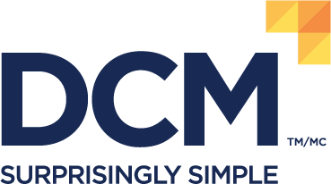

## DATA Communications Management
- Junior IT Infrastructure Administrator | May'23 - Aug'23
- 
- Tags: DATA Communcations Management
- Badges:
  - Powershell [blue]
  - Network Topology [blue]
- List Items:
  - Developed a PowerShell script to automate server monitoring by pinging 120+ servers periodically to maintain an up-to-date active server list.
  - Created comprehensive network diagrams using Microsoft Visio to depict the connectivity and layout of the entire DCM network and Azure Virtual Network

## Midnight Sun Solar Car Team
- Hardware Subteam Member | Sep'22 - Jan'23
- 
- Tags: Midnight Sun Solar Car Team
- Badges:
  - Altium365 [blue]
  - Altium Designer [blue]
- List Items:
  - Worked in a team of 8 people to design printed circuit boards for the Battery Management System using Altium Designer to increase the speed of firmware implementation
  - Searched and added new I/O expanders and kill switches on Digi-Key for the Altium 365 component library to decrease the time to search for parts

## Smith-Rogers Financial
- Data Entry Clerk | Jun'22 - Aug'22
- 
- Tags: Smith-Rogers Financial
- Badges:
  - MS Office [blue]
- List Items:
  - Organized 200+ investment statements in an online database by scanning the physical copies and uploading to an online network to increase the speed of information retrieval
  - Condensed and reviewed 500+ client portfolios to ensure information on all clients are up to date