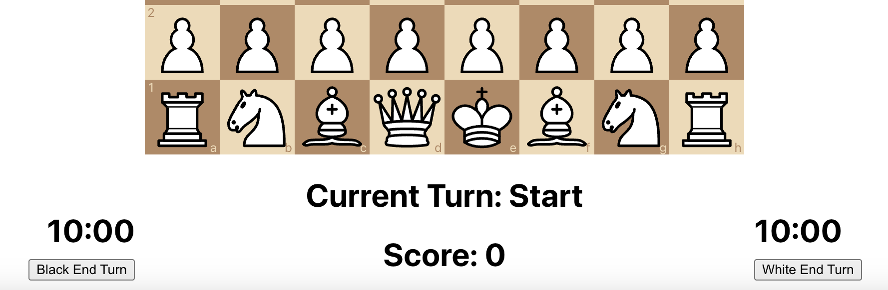
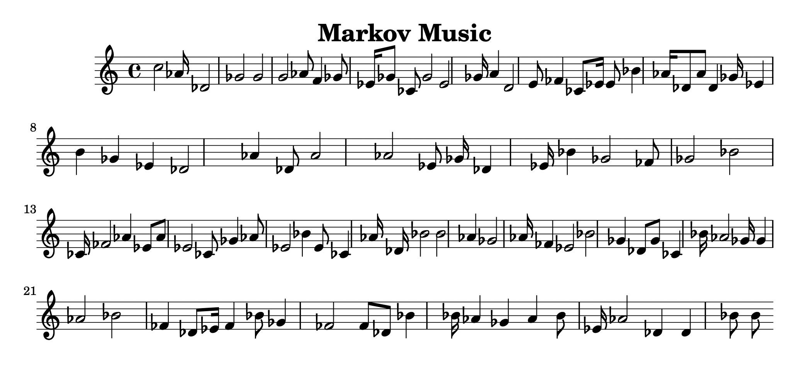
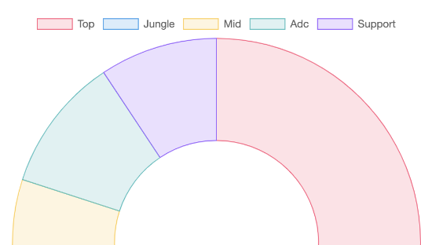

## Taser Chess
A chess robot that provides real-time feedback through electrical shock from a TENS Unit when a player makes a sub optimal move. Implemented a React.js webpage to display the current board state
- 
- Tags: Taser Chess
- Badges:
  - C++/Arduino [blue]
  - Javascript [blue]
  - React.js [blue]
  - Node.js/Express.js [blue]
  - Sockets.io [blue]
- Buttons:
  - Link [https://github.com/YellowCucumber23/zipzap]

## Markhov Music
This application takes in a midi file and parses it to create sheet music with the a similar note patterns and pitches
- 
- Tags: Markhov Music
- Badges:
  - C++ [blue]
  - Binary Parsing [blue]
- Buttons:
  - Link [https://github.com/YellowCucumber23/Markhov-Music]

## League of Legends Role Analyzer
Implented Riot Games API with Reactjs to display the match history, most played roles and win rates of the top 500 League of Legends Players
- 
- Tags: League of Legends Role Analyzer
- Badges:
  - React.js [blue]
  - Javascript [blue]
  - Python [blue]
  - HTML/CSS [blue]
- Buttons:
  - Link [https://github.com/YellowCucumber23/Riot-API-Project]